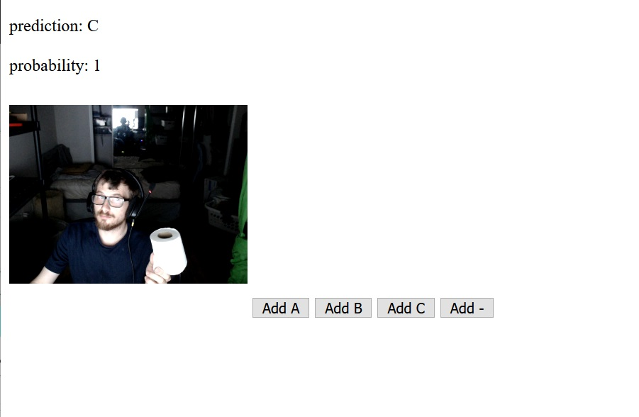

# Transfer Learning Image Classifier
### Custom image classifier that is trained on the fly in the browser using TensorFlow.js

__0riginally__ built in [colabs at Google](https://codelabs.developers.google.com/codelabs/tensorflowjs-teachablemachine-codelab/index.html#7)
## What it does:
- Loading pretrained MobileNet model; making a prediction on new data
- Making predictions through the webcam

#### This helped me understand:

